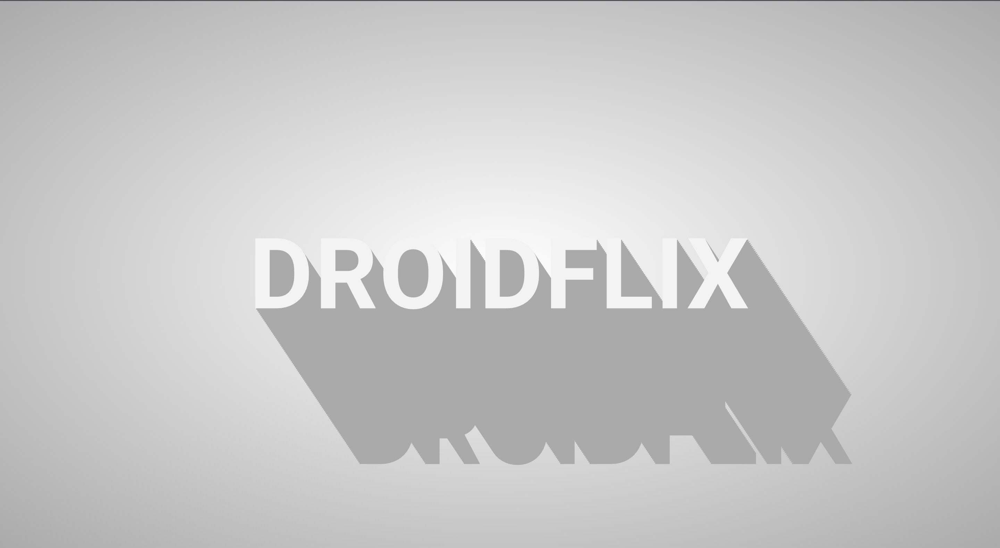
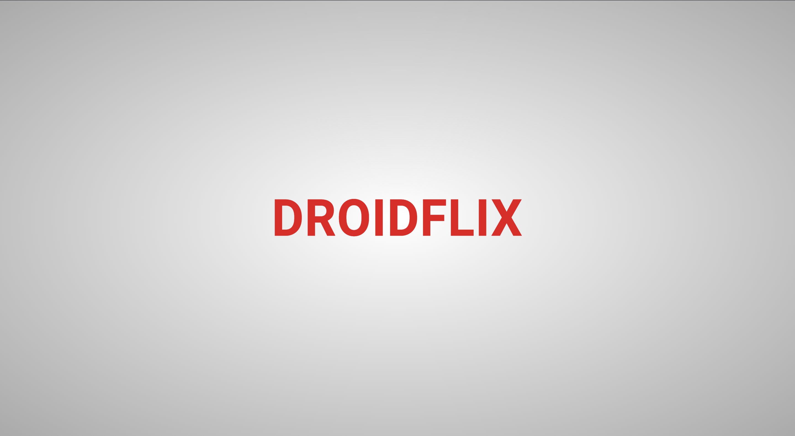

<p align="center">
  <a>
    
  </a>
  <h1 align="center">DROIDFLIX</h1>  
</p>

<br/>

# Introduction

[DroidFlix](https://droid-flix.vercel.app/) is a web application that allows users to list latest movies and TV shows. The app was developed using the React.js framework and utilizes the TMDB (The Movie Database) API for fetching data.

<br/>

# :sparkles: Main Features

- Search for movies and TV shows.
- View details about each title, including the release date and synopsis.

<br/>

# :camera_flash: Screenshots

<div align="center" style="margin:auto;width:100%;display:flex;justify-content:center;align-items:center;flex-wrap:wrap;">




</div>

<br/>

# Getting Started

### Once you have Flutter installed, you can clone this repository to your local machine:

```js bash
git clone https://github.com/MrMischievousX/DroidFlix.git
```

### Install dependencies:

```js bash
npm install
```

### Get your TMDB api key from [here](https://www.themoviedb.org/signup) and create .env file in root folder.

```js bash
REACT_APP_Api = YOUR_API_KEY;
```

<br/>

# Disclaimer

DroidFlix is a third-party app and is not affiliated with TMDB or any other content provider. Please exercise caution when using the app and make sure to comply with all applicable laws and regulations.

<br/>

# Contributing

Contributions to DroidFlix are welcome! If you'd like to contribute, please fork the repository and create a pull request with your changes.
